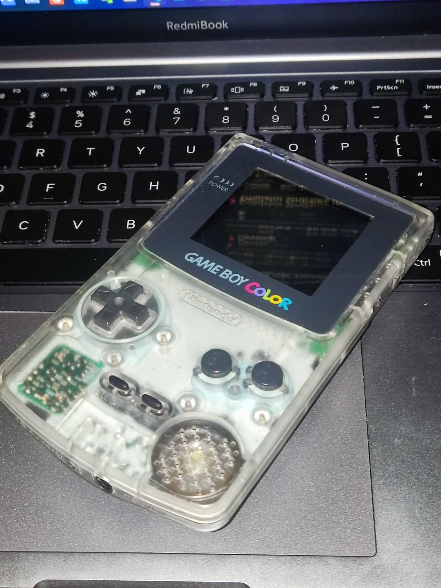
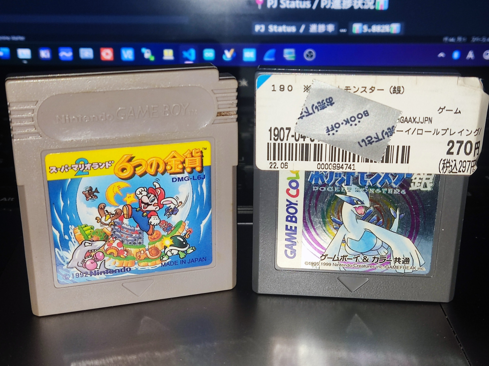
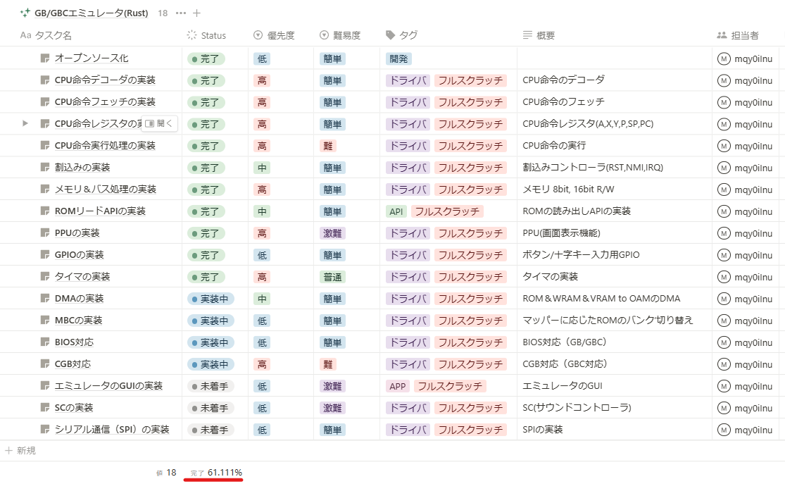

# 📍Rust GB/GBC Emulator (made in Japan🎌🍣)
This repository is making a GB/GBC emulator as a Rust study 😉😁😃.   

  
(`Rustの勉強`で`『習うより慣れろ』`でゲームボーイエミュレータを作成中　(≧▽≦) /  
※ マイコン畑なC/C++の組み込み屋さんのRust奮闘記でもあるwww)  

# 📍Develop
I purchased a `🤑$30 GBC🤑` and`🤑$2 GB/GBC Soft🤑`.  
I am developing an emulator based on them! (I even took it apart and analyzed it)  

# 📍PJ Status / PJ進捗状況📊
## `PJ Status / 進捗率` ... `📊61.11%📊`  
`Sorry for Japanese 🙇`  

# 📍Reference🎓📘📖
## GB/GBC Reference🎓📘📖
https://gbdev.io/  
https://gbdev.io/pandocs/  
https://github.com/gbdev/awesome-gbdev  

### [Japanese]
https://www.dkrk-blog.net/game/gb_dev_basic  
  
## GB Video Reference🎓🎞️📺
https://www.youtube.com/embed/HyzD8pNlpwI  
https://www.youtube.com/watch?v=RZUDEaLa5Nw&t=22s  
https://www.youtube.com/watch?v=ecTQVa42sJc  